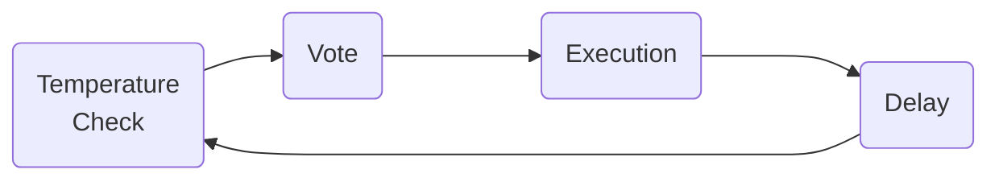

# Governance Cycle

Nance embraces the concept of a _Governance Cycle_. Originally born from Juicebox's concept of a [funding cycle](https://docs.juicebox.money/dev/learn/glossary/funding-cycle/), a Governance Cycle is a set amount of time that a DAO has to propose, discuss, vote, and execute proposals. Utilizing cyclical governance has many advantages over ad-hoc or asynchronous governance:
1. **Predictable** - organization members know when they need to propose and vote
2. **Less voter burnout** - voters have preset days they know they will need to vote, no need to constantly check for new proposals
3. **Batched execution** - grouping proposal actions by cycle allows for more efficient execution
4. **Time to refine ideas** - organization members can refine their ideas if they are rejected on an initial vote

## Implementation

Nance is setup to track 4 stages of a Governance Cycle

---

---

1. **Temperature Check** _(suggestion: 3 days)_
    * organization members provide feedback on proposal content
    * proposal authors can refine their proposal
    * simple 👍 👎 poll is taken (typically in Discord)
    * proposals that achieve a configurable threshold of positive feedback by the end of this stage are moved to the Vote stage 
2. **Vote** _(suggestion: 4 days)_
    * organization members vote on proposals, typically using their token-weighted voting power
    * off-chain signature voting backed by [Snapshot](/docs/integrations/snapshot.md)
    * proposals that achieve a certain threshold of positive votes are moved to the Execution stage
    * _Nance supports complex passing thresholds in addition to simple majority_
3. **Execution** _(suggestion: 4 days)_
    * signers of the organization's [Safe](https://safe.global) assemble to execute proposals
    * if using a Juicebox treasury, proposals must be executed before the [edit deadline](https://docs.juicebox.money/user/project/#edit-deadline)
    * _Nance allows multiple proposal actions to be rolled into a single safe multicall transaction, easing Safe signer burden_
4. **Delay** _(suggestion: 3 days)_
    * downtime between Governance Cycles
    * organization members can propose new ideas during this time for the next Governance Cycle

_Nance recommends a 14 day Governance Cycle, but if your organization needs more or less time for each stage, Nance is configurable to your needs!_

Next we'll walk through the stages that a proposal goes through during a Governance Cycle within the Nance platform starting with [Propose](/docs/basics/propose.md).
