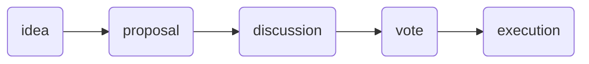

# What is Governance?

Governance is a process or procedure that outputs a decision.

Some examples of organizations with governance processes are:
countries, corporations, and [DAOs](https://ethereum.org/en/dao/). In order for organizations to adapt and change (hopefully for the better) they must formulate ideas and decide which concepts to actualize.

Each organization has a different method of **proposing, discussing, voting,** and **executing** a decision.

## How DAOs Govern

Briefly, DAOs are member owned organizations (think co-op) with membership typically based upon ownership of the DAOs dedicated fungible (ERC-20) or non-fungible (ERC-721/1155) token.
Any member can formulate an idea and ask the others to vote on it *(Note: some DAOs have a minimum number of tokens that a member must have in order to bring an idea up to a vote)*. 

Each DAO has a different procedure to turn an idea into reality but typically they follow these stages of governance:

Governance facilitators shuffle data between each stage and ensure that the DAO procedure is being followed properly. Each phase in the governance process has different requirements, therefore each phase lends itself to different platforms:

| Governance Stage |        Attributes        |            Suitable Platforms             |
| :--------------: | :----------------------: | :---------------------------------------: |
|       idea       |         dialogue         | chat applications, web forums, town halls |
|     proposal     |        submission        |  web forums, wiki, static site generator  |
|    discussion    |         dialogue         | chat applications, web forums, town halls |
|       vote       |         decision         |     smart contract, signature voting      |
|    execution     | decision submission |       smart contract, trusted team        |
