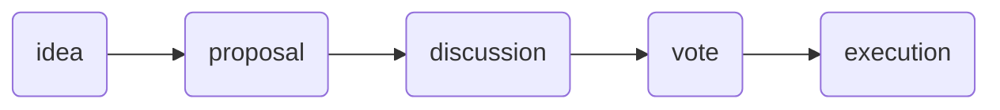

# What is Governance?

Governance is a process or procedure that leads to a decision.

Some examples of organizations with governance processes are:
countries, corporations, and [DAOs](https://ethereum.org/en/dao/). In order for organizations to adapt and change (hopefully for the better) they must formulate ideas and decide which concepts to implement.

Each organization has a different method of **proposing, discussing, voting,** and **executing** a decision.

## How DAOs Govern

Briefly, DAOs are member owned organizations (similar to a co-op) with membership typically based upon ownership of the DAOs dedicated [ERC-20 or ERC-721 token](https://ethereum.org/en/developers/docs/standards/tokens/).
Any member can formulate an idea and the others to vote on it in a transparent and auditable way.

Each DAO has a different process to turn an idea into reality but typically they follow these stages of governance:

Governance facilitators shuffle data between each stage and ensure that the DAO's procedure is being followed. Each phase of the governance process has different requirements, therefore each phase lends itself to different platforms:

| Governance Stage |        Attributes        |            Suitable Platforms             |
| :--------------: | :----------------------: | :---------------------------------------: |
|       idea       |         dialogue         | chat applications, web forums, town halls |
|     proposal     |        submission        |  web forums, wiki, static site generator  |
|    discussion    |         dialogue         | chat applications, web forums, town halls |
|       vote       |         decision         |     smart contract, signature voting      |
|    execution     | decision submission |       smart contract, trusted team        |
